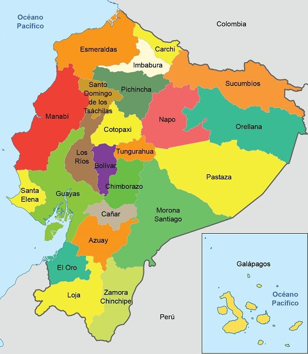

# Descripción de las Regiones del Ecuador

Este repositorio contiene información detallada sobre las principales regiones geográficas del Ecuador: **Costa**, **Sierra**, **Amazonía** e **Insular**. Cada una de estas regiones tiene características únicas en términos de geografía, clima, economía, cultura y turismo, lo que las convierte en áreas vitales para el país.

## Sobre Ecuador

**Ecuador** es un país situado en la región noroccidental de América del Sur, conocido por su diversidad geográfica y cultural. A pesar de ser un país relativamente pequeño en términos de superficie, Ecuador alberga una sorprendente variedad de paisajes que van desde las playas del Pacífico en la Costa, las imponentes montañas de los Andes en la Sierra, las exuberantes selvas tropicales en la Amazonía, hasta el ecosistema único de las Islas Galápagos en la región Insular.

- **Capital:** Quito
- **Idioma oficial:** Español
- **Moneda:** Dólar estadounidense (USD)
- **Población:** Aproximadamente 17 millones de habitantes (Censo Población y Vivienda 2022)

Ecuador es un país multicultural y multiétnico, con una rica historia que incluye la presencia de antiguas civilizaciones precolombinas y una fuerte herencia colonial española. Hoy en día, Ecuador es reconocido por su biodiversidad, con numerosas áreas protegidas y reservas naturales que son de importancia global.

## Contenido del Repositorio

Este repositorio está organizado en cuatro archivos principales que detallan las diferentes regiones del Ecuador:

- [**Costa.md**](./costa.md)
  - Descripción detallada de la región Costa del Ecuador.
  - Información sobre el clima, geografía, economía, cultura y turismo.
  - Tabla de población por provincia de la región Costa.

- [**Sierra.md**](./sierra.md)
  - Descripción detallada de la región Sierra del Ecuador.
  - Información sobre el clima, geografía, economía, cultura y turismo.
  - Tabla de población por provincia de la región Sierra.

- [**Amazonía.md**](./amazonia.md)
  - Descripción detallada de la región Amazonía del Ecuador.
  - Información sobre el clima, geografía, economía, cultura y turismo.
  - Tabla de población por provincia de la región Amazonía.

- [**Insular.md**](./insular.md)
  - Descripción detallada de la región Insular del Ecuador (Islas Galápagos).
  - Información sobre el clima, geografía, economía, cultura y turismo.
  - Tabla de población por provincia de la región Insular.

## Uso del Repositorio

Este repositorio está diseñado para proporcionar una visión general de las diferentes regiones del Ecuador, útil para propósitos educativos, de investigación, o como base para el desarrollo de proyectos relacionados con la geografía y la cultura ecuatoriana.

