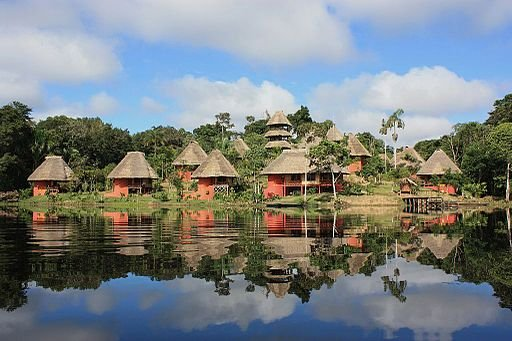
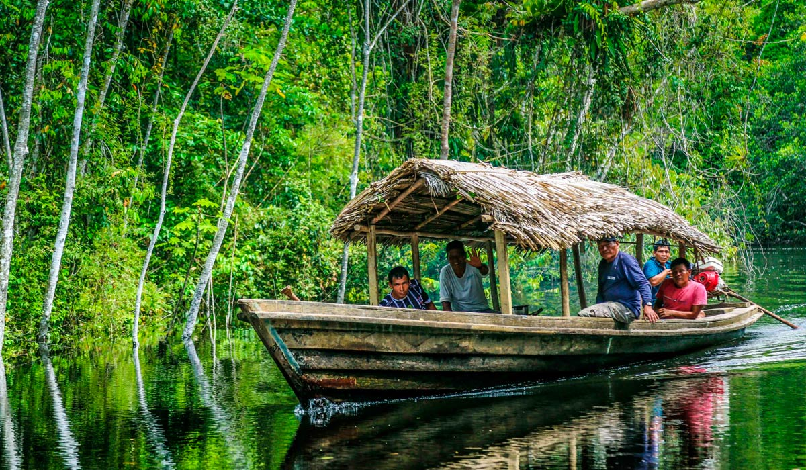

# Región Amazonía del Ecuador

La **región Amazonía** del Ecuador, también conocida como "El Oriente", es una de las cuatro regiones geográficas principales del país, junto con la Costa, la Sierra y la Región Insular (Islas Galápagos). La Amazonía se extiende por la parte oriental del país y abarca varias provincias, incluidas **Napo**, **Orellana**, **Pastaza**, **Morona Santiago**, **Zamora Chinchipe** y **Sucumbíos**.

## Población

De acuerdo al Censo de Población y Vivienda 2022, la region amazónica tiene una población de *928 mil habitantes*. La provincia de Sucumbíos tiene la mayor población a nivel provincial de dicha región, con 199.014 habitantes, representando el *1.17% de la población a nivel nacional*. 

| Provincia           | Población | Porcentaje |
|---------------------|-----------|------------|
| Morona Santiago      | 192,508   | 1.14%      |
| Napo                 | 131,675   | 0.78%      |
| Pastaza              | 111,915   | 0.66%      |
| Zamora Chinchipe     | 110,973   | 0.66%      |
| Sucumbíos            | 199,014   | 1.17%      |
| Orellana             | 182,166   | 1.08%      |

## Clima y Geografía

La Amazonía tiene un **clima tropical húmedo**, caracterizado por:

- **Altas precipitaciones:** Las lluvias son frecuentes y abundantes durante todo el año, con una breve estación menos lluviosa.
- **Temperaturas cálidas:** Las temperaturas suelen oscilar entre los 25°C y 30°C, con alta humedad.

Geográficamente, la región está dominada por la **selva tropical**, parte de la gran cuenca del río Amazonas. Es una de las regiones más biodiversas del mundo, con extensas áreas de bosques lluviosos, ríos caudalosos y una rica fauna y flora.

## Economía

La economía de la Amazonía es diversa, pero en su mayoría se basa en los recursos naturales:

- **Petróleo:** La explotación petrolera es una de las principales actividades económicas, especialmente en las provincias de **Orellana** y **Sucumbíos**.
- **Agricultura y Ganadería:** Se cultivan productos como yuca, plátano, cacao y café. Además, se practica la ganadería, aunque en menor escala comparada con otras regiones.
- **Ecoturismo:** La Amazonía es un destino clave para el ecoturismo, con actividades como la observación de vida silvestre, excursiones en la selva y visitas a comunidades indígenas.

## Cultura

La región Amazonía es hogar de una rica diversidad cultural, con una fuerte presencia de **pueblos indígenas** que mantienen vivas sus tradiciones ancestrales.

### Pueblos Indígenas

- **Kichwa Amazónico:** Son uno de los grupos indígenas más grandes de la región, conocidos por su profundo conocimiento de la selva.
- **Shuar:** Otro grupo indígena importante, famoso por sus habilidades en la guerra y su tradición de los tsantsas (cabezas reducidas).
- **Achuar, Huaorani, y Siona:** Entre otros grupos que habitan en la región, cada uno con su propia lengua y costumbres.

### Gastronomía

La gastronomía amazónica es única y está basada en los productos que se encuentran en la selva. Algunos platos y bebidas representativas incluyen:

- **Maito:** Pescado envuelto en hojas de bijao y cocido a la brasa.
- **Chicha:** Una bebida tradicional fermentada hecha a base de yuca.
- **Cazuelas y sopas:** Preparadas con ingredientes locales como el palmito, la yuca, y carnes de caza.

## Turismo

La Amazonía es un destino turístico fascinante para quienes buscan aventura y contacto con la naturaleza:

- **Parques Nacionales y Reservas:** Como el **Parque Nacional Yasuní**, una de las áreas más biodiversas del planeta, y la **Reserva de Producción Faunística Cuyabeno**.
- **Ecoturismo:** Ofrece experiencias únicas como caminatas por la selva, avistamiento de aves, y convivencias con comunidades indígenas.
- **Ríos y Cascadas:** Los numerosos ríos y cascadas de la región, como el río Napo, son perfectos para actividades como el rafting y la pesca deportiva.

 
