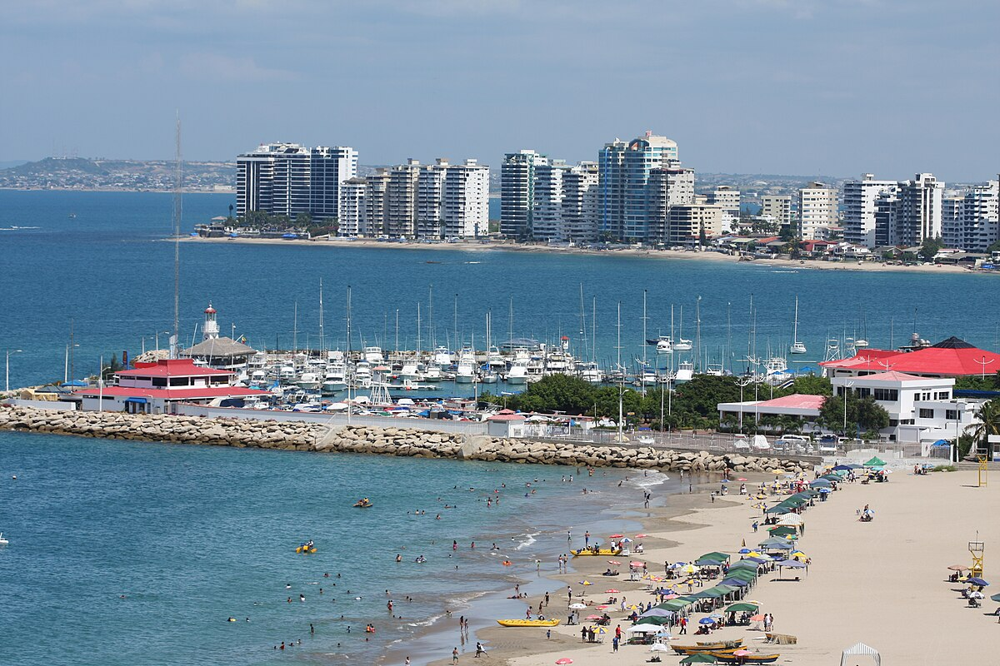
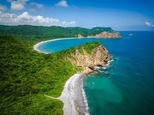

# Región Costa del Ecuador

La **región Costa** del Ecuador es una de las cuatro regiones geográficas principales del país, junto con la Sierra, la Amazonía y la Región Insular (Islas Galápagos). Se extiende a lo largo de la costa del océano Pacífico y abarca varias provincias, incluidas **Esmeraldas**, **Manabí**, **Guayas**, **Los Ríos**, **El Oro** y **Santa Elena**.

## Población

La población de la costa ecuatoriana tiene más de *9 millones de habitantes*, de acuerdo al Censo de Población y Vivienda 2022. El detalle de la población por provincias y su contribución a la población total se describe a continuación. Se destaca que Guayas es la provincia con mayor población en la región costa, con un 25.93% del total a nivel nacional.

| Provincia                | Población | Porcentaje |
|--------------------------|-----------|------------|
| El Oro                    | 714,592   | 4.22%      |
| Esmeraldas                | 553,900   | 3.27%      |
| Guayas                    | 4,391,923 | 25.93%     |
| Los Ríos                  | 898,652   | 5.31%      |
| Manabí                    | 1,592,840 | 9.40%      |
| Santo Domingo de los Tsáchilas | 492,969   | 2.91%      |
| Santa Elena               | 385,735   | 2.28%      |

## Clima y Geografía

La región Costa tiene un **clima tropical** con dos estaciones principales:

- **Estación lluviosa (invierno):** De diciembre a mayo, con temperaturas más altas y lluvias frecuentes, especialmente en el norte.
- **Estación seca (verano):** De junio a noviembre, con temperaturas más moderadas y menos precipitaciones.

Geográficamente, es una región predominantemente **llana**, con áreas de colinas bajas y valles. Sus costas son variadas, con:

- Largas playas de arena.
- Manglares.
- Acantilados.

En el interior, hay zonas agrícolas extensas que son fundamentales para la economía de la región.

## Economía

La Costa es una región económicamente dinámica y diversa. Las principales actividades económicas incluyen:

- **Agricultura:** Cultivo de banano, cacao, café, arroz, caña de azúcar y maíz. *Ecuador es uno de los mayores exportadores de banano del mundo*.
- **Pesca:** Importante en provincias como Manabí y Esmeraldas.
- **Industria y manufactura:** Guayaquil es el principal centro industrial y comercial del país.
- **Petróleo:** Aunque no se extrae en la Costa, la refinación y el transporte juegan un papel importante.

## Cultura

La región Costa es rica en **cultura y tradiciones**, influenciada por la mezcla de culturas indígenas, africanas y europeas.

### Música y Danza

- **Marimba:** Muy popular en Esmeraldas, con una fuerte influencia africana.
- **Pasillo y pasacalle:** Géneros musicales comunes en la región.

### Gastronomía

La gastronomía costera es famosa en todo el país, destacando el uso de mariscos y plátano verde. Algunos platos representativos son:

- **Encebollado**
- **Ceviche**
- **Bolón de verde**
- **Empanadas de verde**

## Turismo

La Costa es una región atractiva para el turismo, conocida por sus playas y reservas ecológicas:

- **Playas:** Salinas, Montañita y Manta son destinos populares.
- **Reservas ecológicas y parques nacionales:** El **Parque Nacional Machalilla** protege una gran diversidad de flora y fauna y alberga la famosa **Isla de la Plata**.
 
 
