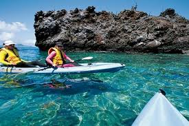
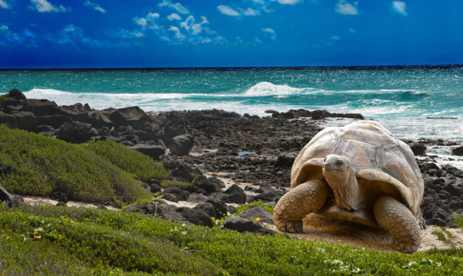

# Región Insular del Ecuador

La **región Insular** del Ecuador, también conocida como **Islas Galápagos**, es una de las cuatro regiones geográficas principales del país, junto con la Costa, la Sierra y la Amazonía. Esta región está compuesta por un archipiélago en el océano Pacífico, aproximadamente a 1,000 kilómetros de la costa ecuatoriana. Las Islas Galápagos son internacionalmente reconocidas por su biodiversidad única y su papel fundamental en la teoría de la evolución de Charles Darwin.

## Población

La población de la región insular asciende a *28.583 habitates* de acuerdo al Censo de Población y Vivienda 2022. Es la región y la provincia de menor población a nivel nacional, representando apenas el 0.17% de la población total.

## Clima y Geografía

La región Insular tiene un **clima subtropical** que varía dependiendo de la altitud y la ubicación en el archipiélago:

- **Estación cálida y húmeda:** De diciembre a mayo, con temperaturas más altas y lluvias esporádicas.
- **Estación seca:** De junio a noviembre, con temperaturas más frescas y la presencia de la corriente de Humboldt, que enfría las aguas y trae neblina.

Geográficamente, las Galápagos son de origen volcánico y están compuestas por 13 islas principales, 6 islas más pequeñas y numerosos islotes y rocas. Las islas más grandes incluyen **Isabela**, **Santa Cruz**, **San Cristóbal** y **Floreana**.

## Economía

La economía de la región Insular está fuertemente orientada hacia el turismo y la conservación:

- **Turismo:** El turismo es la principal fuente de ingresos en las Galápagos. Cada año, miles de visitantes llegan para explorar la biodiversidad única y los paisajes volcánicos de las islas.
- **Conservación y Ciencia:** La investigación científica y los esfuerzos de conservación son fundamentales en la economía de la región, con instituciones como la **Fundación Charles Darwin** desempeñando un papel clave.
- **Pesca:** Aunque limitada debido a las estrictas regulaciones de conservación, la pesca sigue siendo una actividad económica importante para los residentes locales.

## Cultura

La región Insular, aunque menos poblada, tiene una **cultura única** influenciada por la mezcla de personas de diferentes regiones del Ecuador y del mundo que han llegado para trabajar en turismo, conservación y otros sectores.

### Comunidades y Vida Local

- **Isabela, Santa Cruz, y San Cristóbal:** Son las islas más pobladas y donde se encuentran la mayoría de las instalaciones turísticas, científicas y administrativas.
- **Conservación como modo de vida:** Los residentes están profundamente involucrados en la conservación de las islas, y las actividades cotidianas están alineadas con la sostenibilidad y la protección del entorno natural.

### Gastronomía

La gastronomía en las Galápagos está influenciada por la pesca local y los productos que llegan desde el continente. Algunos platos incluyen:

- **Pescados y mariscos frescos:** Como el ceviche de pescado y mariscos.
- **Platos con ingredientes locales:** Como la langosta y el pescado a la brasa.

## Turismo

El turismo es el motor económico de las Galápagos y está estrictamente regulado para proteger el frágil ecosistema del archipiélago:

- **Parque Nacional Galápagos:** Declarado Patrimonio de la Humanidad por la UNESCO, el parque abarca el 97% de la superficie terrestre del archipiélago y ofrece actividades como el senderismo, snorkel, y la observación de la vida silvestre.
- **Biodiversidad única:** Las Galápagos son hogar de especies endémicas como las tortugas gigantes, iguanas marinas y diversas especies de aves, que atraen a científicos y turistas de todo el mundo.
- **Ecoturismo:** Las visitas guiadas y las excursiones son diseñadas para minimizar el impacto ambiental y apoyar los esfuerzos de conservación.

 
