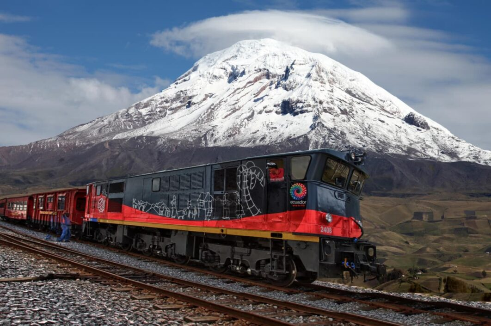

# Región Sierra del Ecuador

La **región Sierra** del Ecuador es una de las cuatro regiones geográficas principales del país, junto con la Costa, la Amazonía y la Región Insular (Islas Galápagos). La Sierra se extiende a lo largo de la cordillera de los Andes y abarca varias provincias, incluidas **Pichincha**, **Azuay**, **Tungurahua**, **Cotopaxi**, **Chimborazo**, **Imbabura**, **Carchi**, **Cañar**, **Bolívar** y **Loja**.

## Población

La Sierra tiene una población aproximada de casi *7 millones de habitantes* de acuerdo al Censo de Población y Vivienda 2022. El detalle de la población de la sierra ecuatoriana y su contribución a la población se muestra a continuación.

| Provincia   | Población | Porcentaje |
|-------------|-----------|------------|
| Azuay       | 801,609   | 4.73%      |
| Bolívar     | 199,078   | 1.18%      |
| Cañar       | 227,578   | 1.34%      |
| Carchi      | 172,828   | 1.02%      |
| Cotopaxi    | 470,210   | 2.78%      |
| Chimborazo  | 471,933   | 2.79%      |
| Imbabura    | 469,879   | 2.77%      |
| Loja        | 485,421   | 2.87%      |
| Pichincha   | 3,089,473 | 18.24%     |
| Tungurahua  | 563,532   | 3.33%      |

## Clima y Geografía

La región Sierra se caracteriza por su **clima andino** que varía considerablemente según la altitud:

- **Zonas Altas:** Clima frío y seco, con temperaturas que pueden bajar por debajo de los 0°C en las noches.
- **Valles Interandinos:** Clima templado, con temperaturas medias que oscilan entre los 15°C y 25°C.

Geográficamente, la Sierra está dominada por la **cordillera de los Andes**, que atraviesa la región de norte a sur. En esta región se encuentran algunos de los volcanes y montañas más altos del país, como el **Chimborazo** y el **Cotopaxi**.

## Economía

La Sierra es una región con una economía variada que incluye:

- **Agricultura:** La producción agrícola es diversa, con cultivos de papas, maíz, cebada, quinua y hortalizas. Además, se practica la ganadería, especialmente de ganado vacuno y ovino.
- **Comercio y Servicios:** Las principales ciudades, como **Quito** (capital del país) y **Cuenca**, son importantes centros de comercio, finanzas, y servicios.
- **Turismo:** La Sierra es un destino turístico popular debido a su riqueza cultural e histórica, así como a sus paisajes naturales.

## Cultura

La región Sierra es rica en **cultura y tradiciones**, profundamente influenciada por las culturas indígenas, en especial las de los pueblos **Kichwa** y **Cañari**.

### Música y Danza

- **Sanjuanito:** Es un género musical tradicional de la Sierra, caracterizado por un ritmo alegre y festivo.
- **Danza:** La danza folclórica es muy popular, con bailes tradicionales que se realizan durante las festividades locales.

### Gastronomía

La gastronomía de la Sierra es variada y está influenciada por los productos agrícolas de la región. Algunos platos representativos son:

- **Cuy asado:** Un plato tradicional preparado con carne de cuy.
- **Llapingachos:** Tortillas de papa rellenas de queso.
- **Fritada:** Carne de cerdo cocida en su propia grasa, acompañada de mote y plátano.

## Turismo

La Sierra es una región muy atractiva para el turismo, ofreciendo una mezcla de historia, cultura y naturaleza:

- **Ciudades Patrimonio:** Quito y Cuenca son reconocidas por la UNESCO como Patrimonio Cultural de la Humanidad debido a su arquitectura colonial y su historia rica.
- **Volcanes y Montañas:** La región es hogar de impresionantes montañas y volcanes, como el Cotopaxi, el Chimborazo y el Cayambe, que son populares entre los montañistas.
- **Mercados Indígenas:** Lugares como Otavalo son famosos por sus mercados artesanales, donde se pueden encontrar textiles y otros productos hechos a mano.

 
